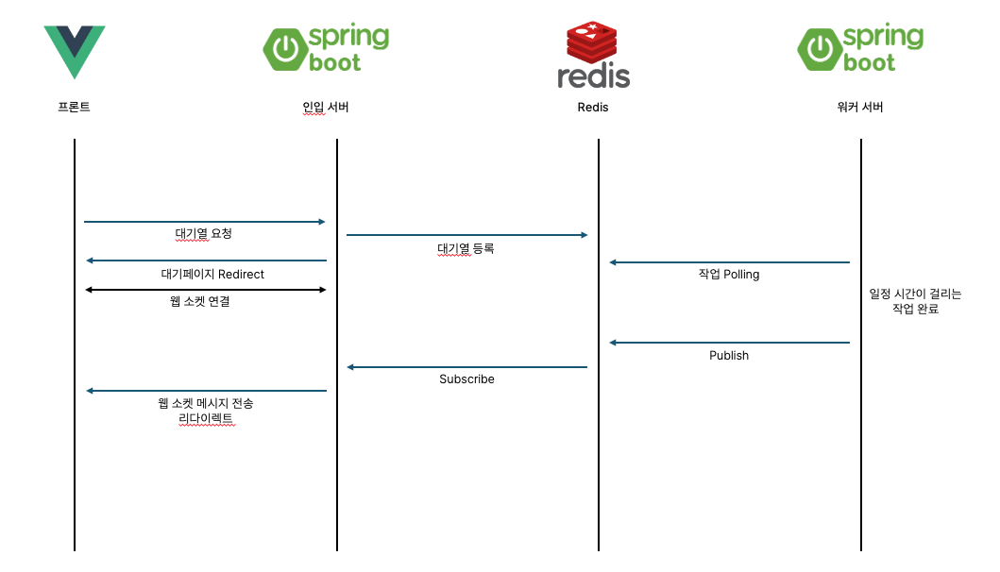
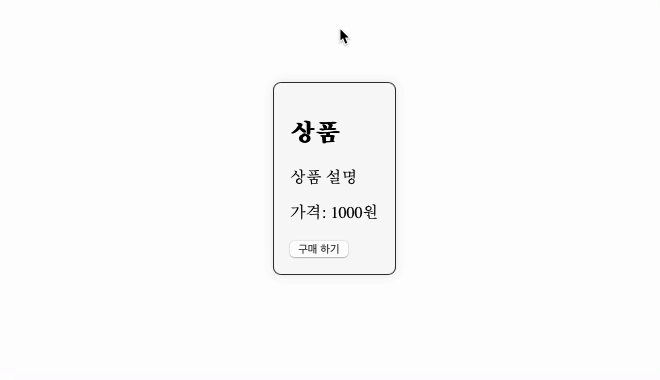
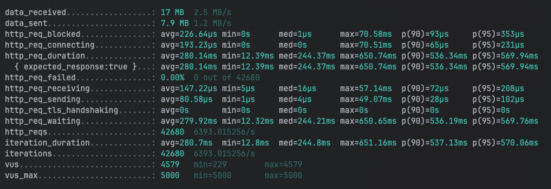
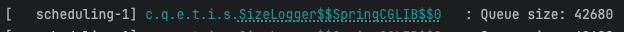
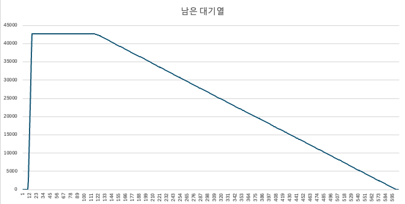

# waitingQueue

대기열 시스템 만들어보기

# 기본 개념

하나의 요청이 들어오면 서버는 해당 데이터를 분석하고 처리하는데 시간이 걸린다고 가정하였습니다.
이때, 다수의 요청이 들어오면 서버는 요청을 순차적으로 처리하게 되는데,
요청에 대한 처리를 순차적으로 하기 위해 대기열을 부여하고 순차적으로 처리하는 시스템을 구상하였습니다.

## 구현 방법



1. 사용자는 페이지에 접속하여 요청을 보낸다.
2. 서버는 요청을 받은 뒤 대기 순번을 부여하고 사용자에게 응답을 보낸다.
   1. redis Sorted Set에 timestamp를 Score로 하여 대기열을 만든다. 
   2. 클라이언트는 대기화면으로 리다이렉트 되고 인입 서버와 웹소켓을 통해 연결을 맺는다.
   3. 클라이언트는 주기적으로 서버측으로부터 현재 대기열 순서를 요청한다.
3. 워커 서버는 대기열에 있는 요청을 반복적으로 가져오고 순차적으로 처리한다.
   1. 서버당 100개의 가상 쓰레드를 만들어 각 쓰레드가 반복적으로 ZPOPMIN 명령어를 통해 티켓을 가져온다.
   2. 해당 티켓 작업이 완료되면 Redis에 publish를 통해 완료되었음을 알린다.
4. 인입 서버는 subscribe를 통해 완료되었음을 전달 받아 웹 소켓을 통해 클라이언트에게 전달한다.
5. 클라이언트는 결과 페이지로 리다이렉트 되어 결과를 확인한다.

## 서버 설명

- entry 서버 
  - 프론트와 연결 되는 인입 서버
  - WebSocket을 통해 클라이언트와 통신
  - Sorted Set(대기열)에 티켓 저장 

- worker 서버
  - 대기열에서 티켓을 가져와 작업을 하는 서버 
  - 작업이 완료된 티켓을 프론트에게 전달하기 위해 완료 이벤트 publish


## 시연 화면



## 테스트

K6를 사용하여 부하를 생성하고 대기열이 잘 동작하는지 확인해 보았습니다.   

```javascript
import http from 'k6/http';

export const options = {
    stages: [
        { duration: '3s', target: 1000 }, // 1000명의 사용자로 시작
        { duration: '3s', target: 5000 }, // 점진적으로 5000명까지 증가
    ],
};

export default function () {
    const url = 'http://localhost:8080/entry';

    const random = Math.floor(Math.random() * 10000000) + 1;
    const data = JSON.stringify({
        redirectUrl: 'testUrl',
        memberSeq: random
    });

    const header = {headers: {'Content-Type': 'application/json',},}

    http.post(url, data, header);
}
```

동시 접속자수를 점진적으로 5,000명으로 증가하도록 설정하여 테스트를 진행하였고   

1. 우선 인입서버만 실행하여 사용자의 요청을 받고 대기열을 넣는다.  

   
총 42680건의 요청이 생성되어 들어갔으며    

    
대기열에도 42680건의 요청이 들어가있음을 확인할 수 있습니다.  

2. 대기열이 잘 동작하는지 확인하기 위해 대기열에 있는 요청을 처리하는 워커 서버를 실행한다.   

    
초반 요청이 차래대로 Sorted Set에 들어가고     
워커 서버 실행 후 대기열이 처리되는 것을 확인할 수 있습니다.  
